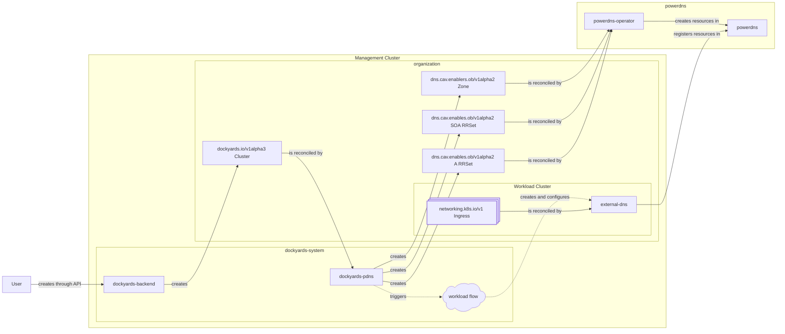

# Dockyards PowerDNS Operator

This repository supplies a small Kubernetes controller that keeps Dockyards clusters in sync with PowerDNS zones. As clusters are created they get healthy DNS zones managed by the operator, and Dockyards workloads such as ExternalDNS are reconciled to publish records through PowerDNS.

## Component diagram


The diagram shows how the operator bridges Dockyards control-plane resources, the management cluster, and the downstream workloads.

- **Management cluster orchestration:** `dockyards-backend` creates `DockyardsCluster` resources, `dockyards-pdns` watches them, and an external helper microservice configures the public namespace so ExternalDNS can publish records.
- **Cluster-owned DNS state:** For every `DockyardsCluster` the controller ensures a `dns.cav.enablers.ob/v1alpha2 Zone` plus `SOA`/`A` RRsets exist so PowerDNS can host the zone.
- **Workload and networking provisioning:** ExternalDNS in the workload cluster reconciles `Ingress` resources and registers DNS records back with PowerDNS, closing the loop.
- **PowerDNS integration:** The PowerDNS operator reconciles the Zone and RRsets and talks to the underlying PowerDNS service (`<pdnsName>-api`/`-dns`) that ultimately serves DNS traffic.

## Architecture context

### Management cluster orchestration
`dockyards-pdns` runs in the `dockyards-system` namespace alongside `dockyards-backend` and relies on an external helper microservice that configures the public namespace. It watches `dockyards.io/v1alpha3 Cluster` objects that represent customer environments and creates the DNS resources the PowerDNS operator expects. As soon as a cluster is reconciled, that helper deploys ExternalDNS so the operator can publish records that point to the workload cluster.

### Organization-owned and workload resources
Each `DockyardsCluster` owns a `dns.cav.enablers.ob/v1alpha2 Zone` and the associated `SOA`/`A` RRsets. The controller keeps those resources labeled and annotated so the PowerDNS operator can reconcile them into real DNS data. Once the zone is marked successful, the controller creates a `Workload` for ExternalDNS, pointing it at the PowerDNS API and DNS endpoints tied to that zone.

### Workload cluster and networking
ExternalDNS runs inside the workload cluster and watches Kubernetes `Ingress` resources (`networking.k8s.io/v1`). When an ingress moves into the desired state, ExternalDNS writes the corresponding records back into PowerDNS so the public DNS matches the cluster’s edge configuration.

### PowerDNS integration
The `powerdns-operator` runs in the PowerDNS namespace and reconciles the Zone/`RRSet` custom resources created by `dockyards-pdns`. It exposes two services, typically named `<pdnsName>-api` and `<pdnsName>-dns`, that the `ZoneReconciler` uses for administration and record publication.

## Key Components

- **`DockyardsClusterReconciler`** (controllers/dockyardscluster_controller.go) watches `dockyards.io` clusters. When a cluster is owned by an organization and not being deleted it ensures a PowerDNS `Zone` exists with the right labels, ownership, and nameserver records.
- **`ZoneReconciler`** (controllers/zone_controller.go) watches the PowerDNS `Zone` resource. Once a zone enters a succeeded state it create/patches the SOA/NS RRsets, discovers PowerDNS API and DNS endpoints, and configures a Dockyards `Workload` that runs ExternalDNS pointing at PowerDNS.
- **`Configuration`** is driven by the Dockyards config reader; keys such as `managementDomain`, `pdnsName`, `pdnsNamespace`, and `publicNamespace` tell the controller how to wire everything together (the `pdnsName` base also names the PowerDNS secret that holds `PDNS_API_KEY`).

## Requirements

- Go 1.25+
- Kubernetes-style controller-runtime tooling (already captured in `go.mod`)
- Access to the Dockyards backend custom resources and PowerDNS services referenced in the config

## Development

```bash
# build the controller binary
go build ./...

# run gofmt or tests if needed
go test ./...
```

`main.go` wires the reconcilers with a controller-runtime manager and relies on `generate.go` for helper annotations when the code is scaffolded.

## Deployment

1. Build/push the controller image as needed.
2. Deploy the controller into a cluster whose `dockyards-system` namespace hosts the Dockyards CRDs, PowerDNS operator, and the sink for the helper microservice that configures ExternalDNS in the public namespace.
3. Set the required config keys via the Dockyards config API so `managementDomain`, `pdnsName`, `pdnsNamespace`, and `publicNamespace` reflect your environment and so the Public namespace exposes the ExternalDNS `Workload` template.

## Troubleshooting

- Check the `dockyards-pdns` and helper microservice logs to understand why zone reconciliation or the ExternalDNS workload rollout might have stalled.
- Validate that the PowerDNS services expose LoadBalancer DNS and ClusterIP addresses (`<pdnsName>-dns` and `<pdnsName>-api`).
- Confirm the `Workload` custom resource template `external-dns` exists in the public namespace referenced by the config and matches the ExternalDNS settings shown in the diagram.

## License

Apache 2.0. See [LICENSE](./LICENSE.md) if provided in the broader project.
